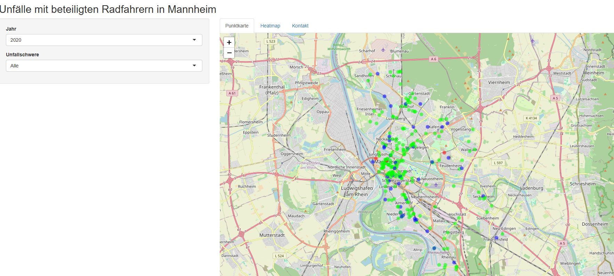

# Mannheim Accident Map

This Shiny application was developed for **ADFC Mannheim** to visualize and explore traffic accident data in Mannheim, Germany. The app allows users to interactively filter accidents by year and severity, using an intuitive, color-coded map interface.

## Vision

This tool supports **Vision Zero** — the goal of eliminating all traffic fatalities and severe injuries — by making accident data accessible for public advocacy, urban planning, and community awareness.

## Preview

  
*A preview of the interactive accident map* (replace with actual image)

## Last Update

**June 9, 2025** — Added accident data for 2024.

## Features

- 🗺️ Interactive map of accident locations in Mannheim  
- 📅 Filter accidents by year (multi-year selection)  
- ⚠️ Filter by accident severity (e.g., light, severe, fatal)  
- 🎨 Color-coded markers for quick visual categorization

## Developed For

Created for **Allgemeiner Deutscher Fahrrad-Club (ADFC) Mannheim**, supporting efforts to improve traffic safety, advocate for safer infrastructure, and advance **Vision Zero** principles in urban mobility.

> 🛠️ This app was developed on a **voluntary basis**. Please don't expect a professional-grade product — but feel free to suggest improvements!

## How to Run

### ▶️ Use the App Online

Access the live version at:

🔗 [https://warnke.shinyapps.io/adfc_mannheim/](https://warnke.shinyapps.io/adfc_mannheim/)

No installation required — just open the link and explore.

---

### 💻 Run Locally (Optional)

1. Clone the repository:
   ```bash
   git clone https://github.com/yourusername/mannheim-accident-map.git
   cd mannheim-accident-map
